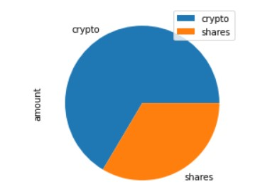

# API_HomeWork
## Libraries and dependecies :
The first thing to do is import libraires and dependencies relevant to the desired tasks.
## Assigning variables to the data provided:
Certain data like amount of crypto ,number of shares, api_keys are assigned variables and thos variables are then utilised in operations that are necessary to get the required results.
To access the data regarding securities asked about in the homework, i shall be using Alpaca platform to retreive the data.
After retreiving data , i shall be computing the dollar amount of crypto, stocks and bonds.
## Visualizing the portfolio:
Aggregating the dollar amount of securities in a data frame so that i can visualize the the holdings with help of a pie chart.

## Emergency Fund:
Using logical statements to determine if the current asset value of the fund meets the minimum threshold that is required for any emergency.
Following was the result based on the provided data :

## Concatenating the stock and bond data :
Joining the data so further operations, for example , MCSimulation can be run on the stock and bond data , and i will be running it to find stats and outcomes of different weighting of the holdings and also by altering the initial investment amount. For this purpose it is neccessary to import Monte Carlo library and dependency.
## Monte Carlo Simulations :
### Outcome of simulation with standard weightage, 60/40, of bonds and stocks respectively : 
Following are the results of this simulation with no. of simulations :500 , projected period : 7560 days.

Following are the stats for this simulation :

The images below are the range of returns with 95% confidence with initial investment and 1.5 times the initial investment :
.jpg, 'Initial Investment')

### For early retirement :
The aforementioned calculations are for 30 years projection for early retirement with the adjustment of variable factors to achieve the approximately same results simulation was run and follwing resuts were achieved with 10 year projected time.
#### By adjusting the weightage of securities :

### By increasing the amount of initial investment :

